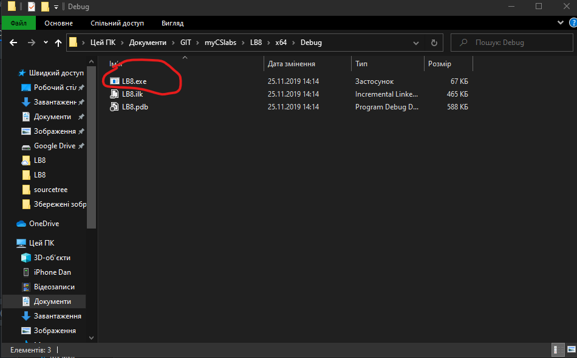

# my labs
#### that's my first year labs in NUWM
### list of labs
* lab8 
* lab7 
* lab5
<table>
    <tr>
        <td>lab</td>
        <td>lab 8</td>
        <td>lab 7</td>
        <td>lab 5</td>
    </tr>
    <tr>
        <td>link</td>
        <td>
<a href="https://drive.google.com/file/d/1JQ8F5enwPrC6hIPpB7WAucD-iSNowmi_/view?usp=sharing">link на завдання</a>
</td>
        <td>
<a href="https://drive.google.com/file/d/1JQ8F5enwPrC6hIPpB7WAucD-iSNowmi_/view?usp=sharing">link на завдання</a>
</td>
        <td>
<a href="https://drive.google.com/file/d/1JQ8F5enwPrC6hIPpB7WAucD-iSNowmi_/view?usp=sharing">link на завдання</a>
</td>
    </tr>
    <tr>
        <td> description </td>
        <td>this lab is about matrix</td>
        <td>in this lab i was learnig arrays</td>
        <td>this lab is about functions and cycles</td>
    </tr>
</table>
<a>to run lab you need to find built program in lab folder. Run .exe program and folow the instructions given in program</a>

